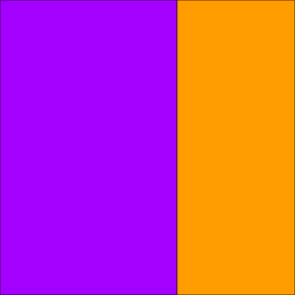
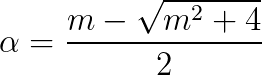
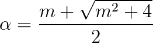
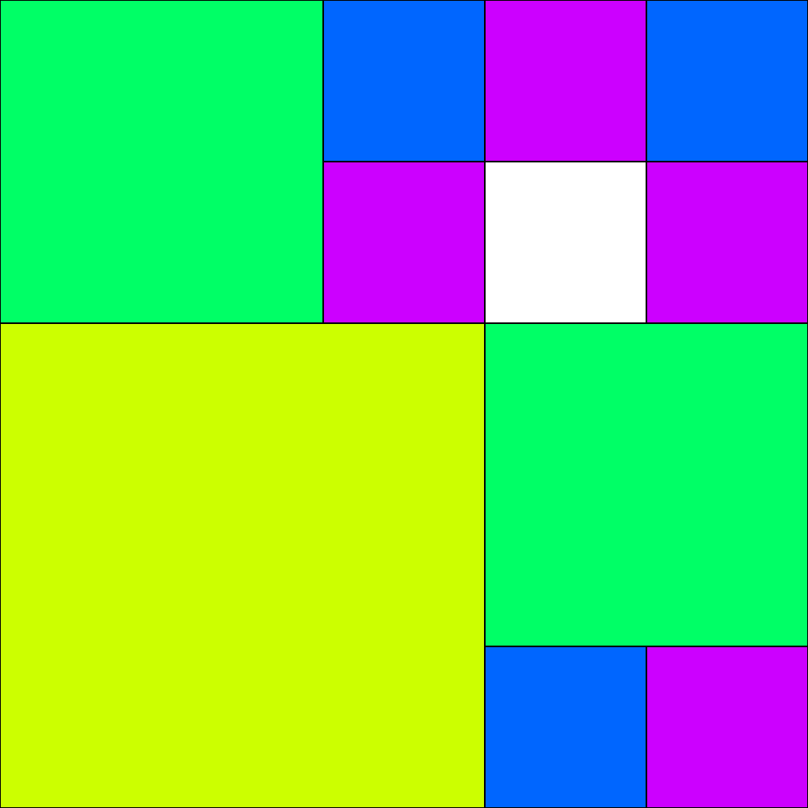
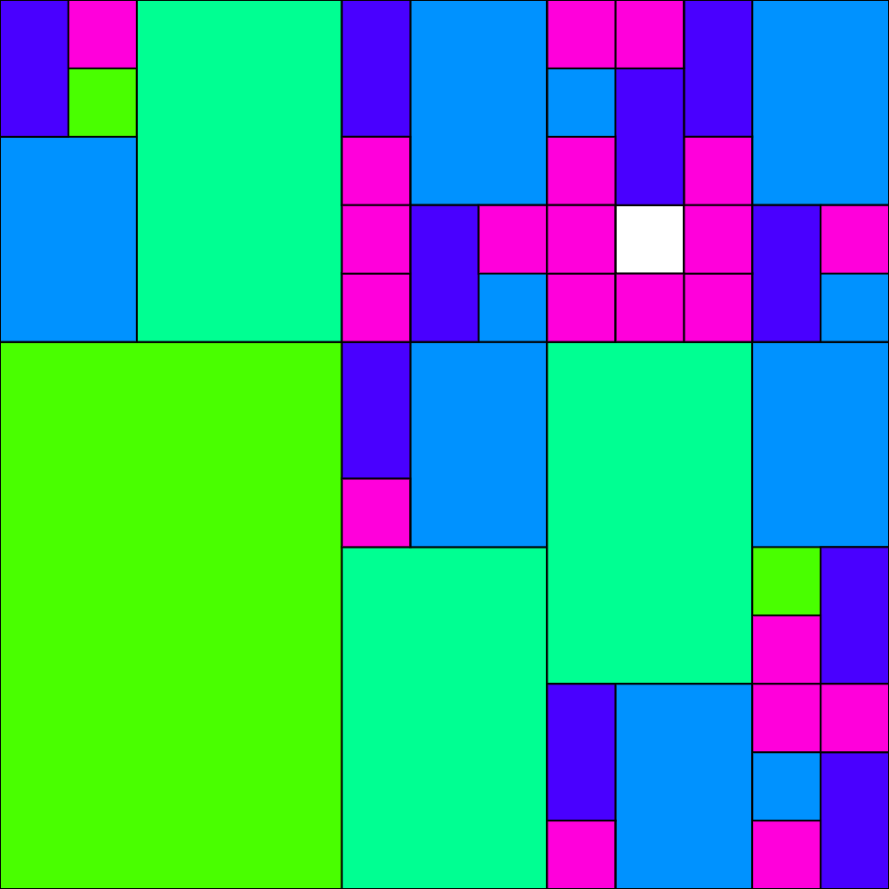
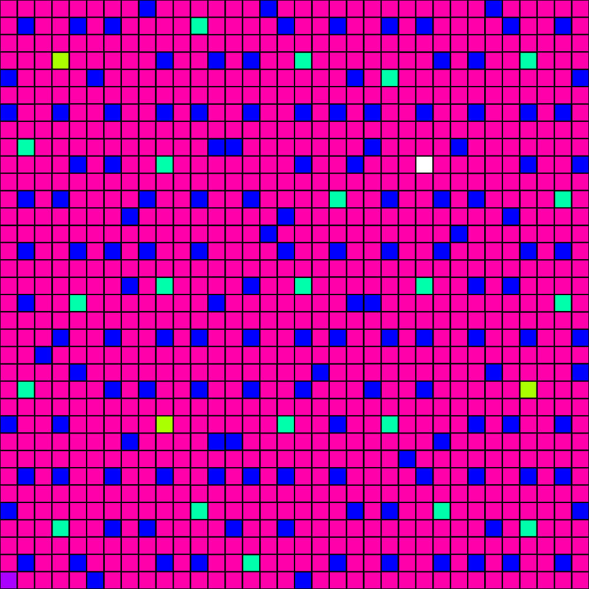
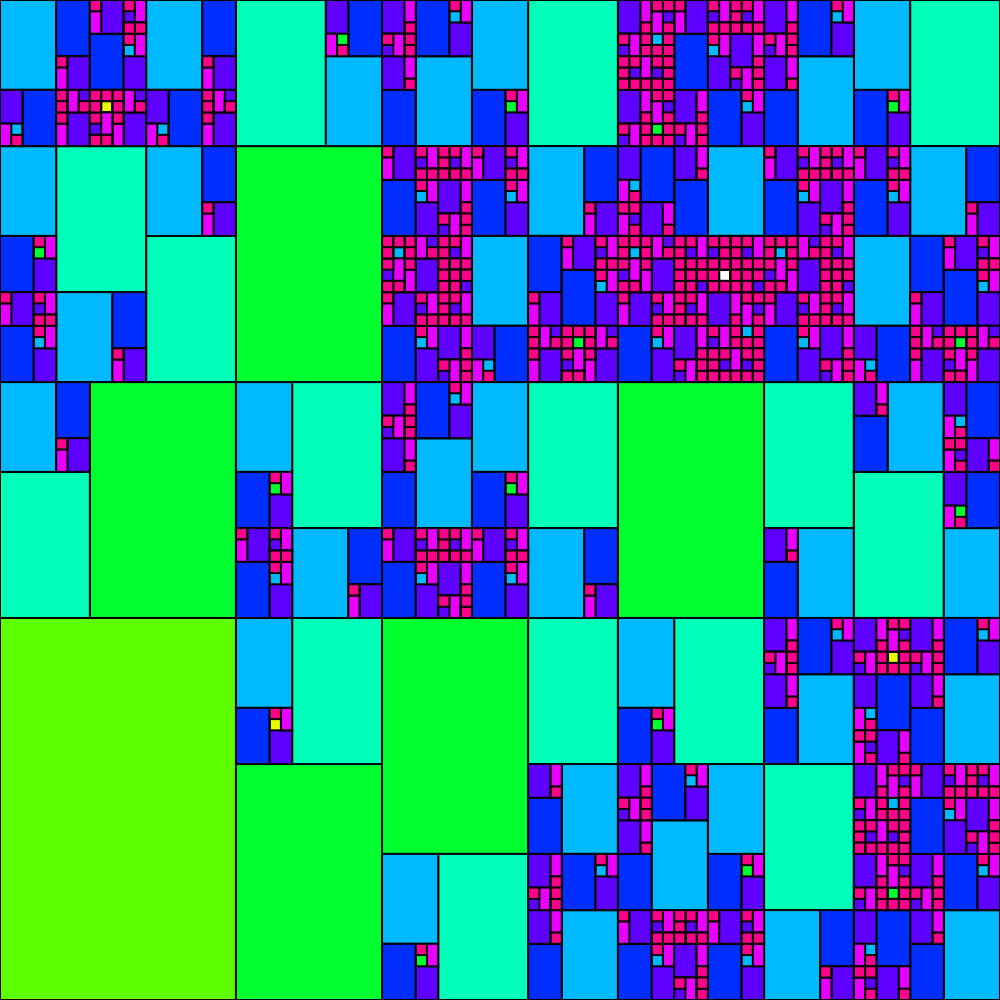
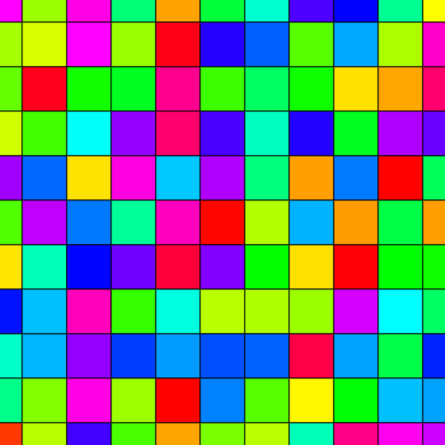
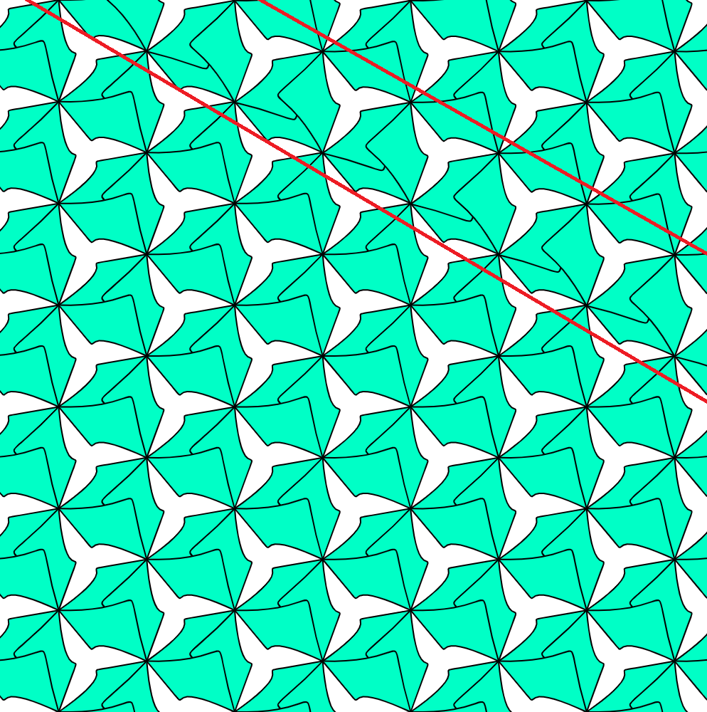

# Errata for 1st version( 2019/05/01 ).

## 1-1. Ch1_Euclid::P.055
### 1-1-1. **Figure 1.6** :  
`numA = 12, numB = 17`  
=>  
`numA = 17, numB = 12`  

## 1-2. Ch1_Euclid::P.064
The figure of the case `thr = 320` seems to be wrong and a correct figure is like below.   


## 1-3. Ch1_Euclid::RecurDivSquare
### 1-3-1. divRect.pde::Line 9
To be accurate, this comparison needs to take the round-off error into accont as Line 12 or 18.  
So, change as  
`while (wd > thr){`  
=>  
`while (wd > thr + 0.1){`  
or normalize `wd` before this comparison.

Interestingly, this fix causes the change of Figure 1.10 case `thr = 40`.
I think both images are beautiful so I don't think this issue has to be fixed😉. 

### 1-3-2. mouseClicked.pde::Line 9
`ratio = (float) numA / numB;`  
=>  
`ratio = (float) numB / numA;`

## 1-4. Ch1_Euclid::RecurDivSquareGUI
### 1-4-1. divSq.pde::Line 9
Same as 1-3-1.

## 2-1. Ch2_ContinuedFrac::Mondrian
### 2-1-1. division.pde::Line 5, Line 33
Same as 1-3-1.

## 2-2. Ch2_ContinuedFrac::GoldDivGUI
### 2-2-1. division.pde::Line 5, Line 33
Same as 1-3-1.

### 2-2-2. color.pde::Line 18
If the function name `changeCol()` is correct,  
`rand1[i] = random(1);`  
seems to be unnecessary to me because this causes the replacement of squares/rects in addition to the change of the color.  
If the current behavior is correct, we should change function's name like below.
`changeCol()` 
=>
`reload()` etc..
(I think the former is a better idea because we are in the file "color.pde".)

## 3-1. Ch3_Fibonacci::P.086
### 3-1-1. Fomula in the middle of this page
<BR>
=>  


## 3-2. Ch3_Fibonacci::Rect
### 3-2-1. Rect.pde::Line 1
`int[] fibo = {0,1,1};`  
=>  
`int[] fibo = {0,1,1,2};`  
Beucase we don't have to access to index 0.

## 3-3. Ch3_Fibonacci::P.094
### 3-3-1. Figures in 3.10
All of the figures seem to be wrong.  
The correct figures are the following ones.  
| Case | Figure |
| :-: | :-: |
| num =  5, thr =  1 |  |
| num =  7, thr =  2 |  |
| num =  9, thr = 13 |  |
| num = 11, thr =  4 |  |

## 5-1. Ch5_FermatSpiral::FermatSpiralLine
### 5-1-1. drawRealCurve.pde::Line 1-7
In `drawLine()`, the result shapes seems to be wrong if the specified `n` is an odd number.  
So we should replace like below: 
```
  for(int i = 0; i <= n / 2; i++){
      ......
    line(v.x, v.y, -v.x, -v.y);
  }
```
=>  
```
  for(int i = 0; i < n; i++){
      ......
    line(v.x, v.y, 0, 0);
  }
```

## 5-2. Ch5_FermatSpiral::P.124, 125
### 5-2-1. Figure 5.8, 5.9, 5.10
The name of the code is wrong.  
`FermatSpiral`  
=>  
`FermatSpiral2`

## 6-1. Ch6_Modular::Table
### 6-1-1. Table.pde::Line 6-9
The position of `// int num = (i * j) % mod;` looks hard to understand a little bit.
```
    int num = (i + j) % mod;
    PVector v = new PVector(j, i);
    v.mult(scalar);
    // int num = (i * j) % mod;
```
=>  
```
    int num = (i + j) % mod;
    // int num = (i * j) % mod;
    PVector v = new PVector(j, i);
    v.mult(scalar);
```

## 6-2. Ch6_Modular::TableVar
### 6-2-1. TableVar.pde::Line 8-11
Same as 6-1-1. 

## 8-1. Ch8_Textile::TextileRepeater
### 8-1-1. drawTable.pde::Line 2
`noStroke();` should be moved to just before TextileRepeater.pde::Line 25  
so that we can use same file in TextileGenerator and improve efficiency a little bit.

### 8-1-2. drawTable.pde::Line 9-10
The initialization below is not invalid  
because following `randomize()` will replace these values soon.
```
color colorTate = color(255, 255, 0);  //タテ糸の色(黄)
color colorYoko = color(255, 0, 0);  //ヨコ糸の色(赤)
```
=>
```
color colorTate;
color colorYoko;
```

### 8-1-3. drawTable.pde::Line 24
`strokeWeight(1);` is invalid due to `noStroke()` in `drawTable()`.  
Please delete it.

### 8-1-4. drawTable.pde::Line 24
Following codes are invalid due to `noStroke()` in `drawTable()`.
```
strokeWeight(3);
line(0, scalar * columnA, width, scalar * columnA); //罫線の描画
line(scalar * columnA, 0, scalar * columnA, height);
```
If these lines are needed, insert `stroke( BLACK );` just before `strokeWeight(3);`.  
Otherwise, delete these lines.  
In my opinion, I prefer `grey` line with `strokeWeight(1)`;

## 9-1. Ch9_Symmetry::CubicBezier
### 9-1-1. getVertex.pde
This file name seems to be wrong.
`getVertex.pde`
=>
`getMidPoint.pde`

## 9-2. Ch9_Symmetry::P.213
### 9-2-1. Figure 9.11
There are 4 mistakes on the description of the figures like below.
Ex. `num = 6` => `gon = 6`. 

## 10-1. Ch10_Lattice::P.219
### 10-1-1. Figure 10.5
This figure slightly differs from the result below.  


## 10-2. Ch10_Lattice::HexTiling
### 10-2-1. tile.pde
We don't need this file.

## 10-3. Ch10_Lattice::P.214
### 10-3-1. description
`HexCA` program do not use function on mouse events.
So please delete mouse-mark on this.

## 11-1. Ch11_Deformation::TV08
### 11-1-1. deformHex.pde::Line 6
`v[i] = parameterizeTV08(v, i);`  
=>  
`parameterizeTV08(v, i);`  
because `parameterizeTV08()` updates `v[i]` value in the function.

## 11-2. Ch11_Deformation::P.238
### 11-2-1. text in seconde paragraph
これは正六角形タイリングの`makeHex`関数  
=>  
これは正六角形タイリング`HexTiling`の`makeHex`関数  

## 11-3. Ch11_Deformation::IH02TV08
### 11-3-1. deformHex.pde::Line 6
Same as 11-1-1. 

## 11-4. Ch11_Deformation::IH41Koch
### 11-4-1. parameterizeIH41.pde
We don't need this file.

## 11-5. Ch11_Deformation::IH01Koch
### 11-5-1. parameterizeIH01.pde
We don't need this file.

## 11-6. Ch11_Deformation::IH02TV08Koch
### 11-6-1. parameterizeIH02.pde
We don't need this file.

## 11-7. Ch11_Deformation
### 11-7-1. P.228 Description
`IH02TV08Koch` needs an icon of `CP5` instead of `mouse`'s one.

### 11-7-2. P.245 Figure 11.18
The icon of the description for Lower-left figure `IH02TV08Koch` is wrong.
Please change `mouse` icon to `CP5` icon.

## 12-1. Ch12_Pattern::P3
### 12-1-1. Figure 12.9
Lower-left figure has a non-periodic block like below.  


The code might has a bug on this issue in the function `makeRhomb()` but I could not fix it.

