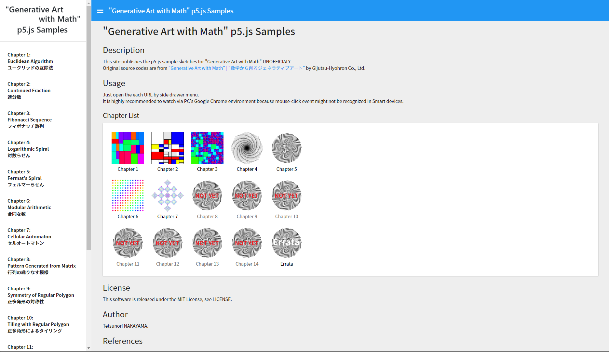

# "Generative Art with Math" p5.js Samples
Version 1.0.0  

# Description
This site publishes the p5.js sample sketches for "Generative Art with Math" **UNOFFICIALY**.  
Original source codes are from ["Generative Art with Math" | "数学から創るジェネラティブアート"](https://gihyo.jp/book/2019/978-4-297-10463-4) by Gijutsu-Hyohron Co., Ltd. 

# Usage
Just open the each URL by side drawer menu.  
It is highly recommended to watch via PC's Google Chrome environment because mouse-click event might not be recognized in Smart devices.  

# Licence
This software is released under the MIT License, see LICENSE.

# Author
Tetsunori NAKAYAMA.

# References
## Codes
- p5.js  
  https://p5js.org/

## Generative Art with Math
 - Book  
  https://gihyo.jp/book/2019/978-4-297-10463-4
  
 - Openprocessing  
  https://www.openprocessing.org/user/57914

