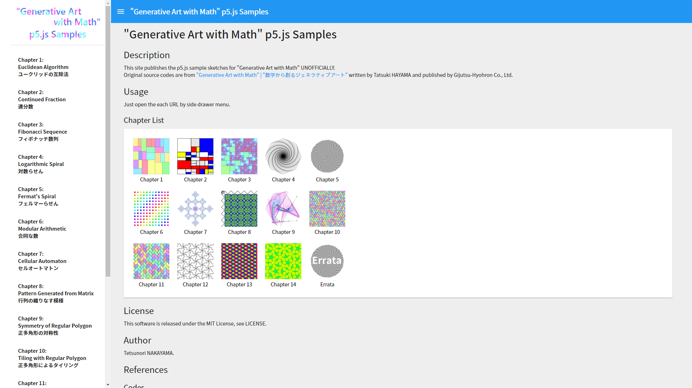

# "Generative Art with Math" p5.js Samples
Version 1.0.0  

# Description
This site publishes the p5.js sample sketches for "Generative Art with Math" **UNOFFICIALLY**.  
Original source codes are from ["Generative Art with Math" | "数学から創るジェネラティブアート"](https://gihyo.jp/book/2019/978-4-297-10463-4) written by Tatsuki HAYAMA and published by Gijutsu-Hyohron Co., Ltd. 

# Usage
Just open the each URL by side drawer menu.  

# Licence
This software is released under the MIT License, see LICENSE.

# Author
Tetsunori NAKAYAMA.

# References
## Codes
- Same sketches on OpenProcessing  
  [Tagged with 'Ported from Generative Art With Math'](https://www.openprocessing.org/browse/?q=Ported%20from%20Generative%20Art%20With%20Math&time=anytime&type=tags#)

## Generative Art with Math
 - Book  
  ["Generative Art with Math" | "数学から創るジェネラティブアート"](https://gihyo.jp/book/2019/978-4-297-10463-4)

